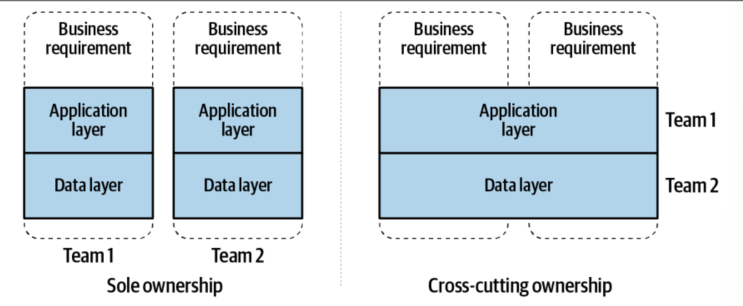

# Revisiting EDA
The following theoretical revision will be based on the following book:
- Building Event Driven Microservices by Adam Bellemare, 2020 (O'Reilly)

It is meant to be a collection of notes and summaries of the most important concepts and ideas presented in the book. 

## Event-Driven Microservices
There seems to have been a shift from consuming events (meaning they get destroyed) towards saving them and using them multiple times. Looks like systems are not merely message-passing systems anymore.

These microservices are usually quite small, able to be produced in a couple of weeks and should conceptually "fit within one's head".

Service flow of operation
-> Consume Events from input event streams 
-> Apply business logic 
-> Perform an action like producing own Events, contacting an API, doing some form of task.

They can be stateful or stateless, varying in complexity and can be their own standalone application or executed as a function-as-a-service.

Definitions: 
- Input event streams are continuous, time-ordered sequences of events or messages generated by sources like user interactions, sensor data, system changes etc. They are processed in real-time as they get published. They can be processed by message brokers, directly to consumers, etc.
- Function-as-a-Service (FaaS) is (in a very rudimentary way) a form of service that holds very little function, and its primary use is to react to an event and do something. It differs from a microservice by scaling automatically and not being always "on". It appears instances of a FaaS are created as required, and their lifetime ends with the task (???). Moving on.

## DDD and Bounded Contexts
Reviewing some concepts:
Domain -> The problem space that the business occupies and provides solutions to.
SubDomain -> Domain is broken down is subdomains like Warehouse, Sales, Engineering by focusing on a subset of responsibilities.
Bounded Context -> Logical boundary. Ideally these should be tightly bounded to the subdomain, but due to a multitude of reasons it may not. For example, a subDomain called Order may have the "Order management" and "Shipping" bounded contexts.

Imagine a company whose Domain is Technology; subdomains are Engineering, Sales, Customer support; Now in terms of the responsibility of each subdomain, each responsibility can be further broken down into specific tasks. For example, to fulfill the responsibility of handling "Order", this can be brokn down into "Register Order", "Process Order", "Ship Order", etc. Each of these tasks is a bounded context.

When each task is clear enough (and self-limited, by a bounded context!), it is ready to be turned into a microservice.

## Bounded contexts and business requirements
It is crucial to align bounded contexts with business requirements, in opposition with technical requirements.  This design is much favourably equipped to deal with change as microservices implemented this way are loosely coupled and highly cohesive.

Now imagine if the bounded contexts were aligned with technical requirements. The risk of creating coupling between microservices was much greater, with all the necessary control features that would have to be implemented. Aside from that, considering clear microservices allow teams to be also not dependent on each other, therefore raising productivity.


(Figure 1-2, p.6 - Book above)

Obviously one can argue that utilizing two application layers might be duplicating a lot of code, however it is generally accepted that the cost of coupling is far more costly in the long run.

## Events as basis of communication
The event driven approach offers an alternative to the traditional behaviour implementation and data communication structures. Not a replacement, but an alternative with its pros and cons.

An event-streaming data communication structure decouple productions and ownership of data. Services no longer couple through request/response APIs, but instead communicate via data defined within Events. 

The event streams form a continuous narrative detailing everything that has happened within an organization. Nearly everything can be communicated via events, from simple occurrences to stateful records. Events in itself are data, not merely signals. They can act as both storage and means of asynchronous communication.

The event stream can be seen as the single source of truth. If conflicting data is put elsewhere without being reflected in the event stream, it significantly impedes the ability of using the event stream as a reliable source of truth (well, obviously).

Term definition:
- Asynchronous communication: It is understood that asynchronous communication refers to interactions where the sender and receiver operate independently, allowing the sender to continue processing without waiting for receivers response. This enables NON-BLOCKING operations, where tasks can proceed concurrently. An example of this is a simple class calling another within:
```java
public class A {
    public void doSomething(AnotherClass anotherClass) {
        anotherClass.doMegaComplexTaskThatTakes3Hours();
        System.out.println("I will only print after 3 hours");
    }
}
```
In this case, the method `doMegaComplexTaskThatTakes3Hours()` will block the execution of the program until it finishes. If we were to make it asynchronous, we would have to use threads or some other form of concurrency.

## Consumers perform their own modeling and querying
With event-based data communication structure, consumers are responsible for modeling the data received (meaning the Events are not necessarily 1:1 to objects within the system, and it is the responsibility of the consumer to grab the data and apply specific business logic), formulate complex queries and write to a database. "Both producers and consumers are otherwise relieved of their duty to provide querying mechanisms, data transfer mechanisms, API and cross-team services for the means of communicating data". This statement basically means that producers and consumers cannot be called directly, therefore not having API and do not have set data transfers mechanisms (I suppose apart from their ability to create Events - Definitely they do not offer a getData()).

## The shift of the communication paradigm
With event-driven communications, we can also sort of better adhere to bounded context principle of loose coupling and high cohesiveness. My personal understanding of this is that one way to violate the bounded context is for a system to directly request data from another system (coupling). By broadcasting all the data via Events, a particular system can simply obtain data from other systems by going to the event stream. 

This is also great as the data in the form of events can be used by all services, regardless of how novel they are and does not rely on particular implementations. The implementations themselves are the ones responsible for sorting the data.

## Asynchronous Event-Driven Microservices
"Event-driven microservices enable the business logic transformations and operation necessary to meet the requirements of the bounded context". My understanding is that Event-driven microservices allow each service to focus on its specific business logic and data transformations according to its bounded context. By processing events relevant to their context, services can independently handle their own data and operations without directly depending on others. This approach supports high cohesion within each service and loose coupling between services, aligning well with the principles of bounded contexts.

Using event-driven microservices is then quite beneficial as it promotes granular services (therefore easily rewritten if business requirements change); they can be scaled as needed; as they are bounded, they can easily employ different technologies (and different teams)