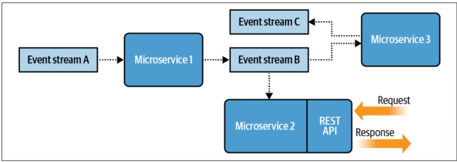

# Why use event-driven microservices
The following theoretical revision will be based on the following book:
- Building Event Driven Microservices by Adam Bellemare, 2020 (O'Reilly)

It is meant to be a collection of notes and summaries of the most important concepts and ideas presented in the book. 

## Event-Driven Microservices
There seems to have been a shift from consuming events (meaning they get destroyed) towards saving them and using them multiple times. Looks like systems are not merely message-passing systems anymore.

These microservices are usually quite small, able to be produced in a couple of weeks and should conceptually "fit within one's head".

Service flow of operation
-> Consume Events from input event streams 
-> Apply business logic 
-> Perform an action like producing own Events, contacting an API, doing some form of task.

They can be stateful or stateless, varying in complexity and can be their own standalone application or executed as a function-as-a-service.

Definitions: 
- Input event streams are continuous, time-ordered sequences of events or messages generated by sources like user interactions, sensor data, system changes etc. They are processed in real-time as they get published. They can be processed by message brokers, directly to consumers, etc.
- Function-as-a-Service (FaaS) is (in a very rudimentary way) a form of service that holds very little function, and its primary use is to react to an event and do something. It differs from a microservice by scaling automatically and not being always "on". It appears instances of a FaaS are created as required, and their lifetime ends with the task (???). Moving on.

## DDD and Bounded Contexts
Reviewing some concepts:
Domain -> The problem space that the business occupies and provides solutions to.
SubDomain -> Domain is broken down is subdomains like Warehouse, Sales, Engineering by focusing on a subset of responsibilities.
Bounded Context -> Logical boundary. Ideally these should be tightly bounded to the subdomain, but due to a multitude of reasons it may not. For example, a subDomain called Order may have the "Order management" and "Shipping" bounded contexts.

Imagine a company whose Domain is Technology; subdomains are Engineering, Sales, Customer support; Now in terms of the responsibility of each subdomain, each responsibility can be further broken down into specific tasks. For example, to fulfill the responsibility of handling "Order", this can be brokn down into "Register Order", "Process Order", "Ship Order", etc. Each of these tasks is a bounded context.

When each task is clear enough (and self-limited, by a bounded context!), it is ready to be turned into a microservice.

## Bounded contexts and business requirements
It is crucial to align bounded contexts with business requirements, in opposition with technical requirements.  This design is much favourably equipped to deal with change as microservices implemented this way are loosely coupled and highly cohesive.

Now imagine if the bounded contexts were aligned with technical requirements. The risk of creating coupling between microservices was much greater, with all the necessary control features that would have to be implemented. Aside from that, considering clear microservices allow teams to be also not dependent on each other, therefore raising productivity.


(Figure 1-2, p.6 - Book above)

Obviously one can argue that utilizing two application layers might be duplicating a lot of code, however it is generally accepted that the cost of coupling is far more costly in the long run.

## Events as basis of communication
The event driven approach offers an alternative to the traditional behaviour implementation and data communication structures. Not a replacement, but an alternative with its pros and cons.

An event-streaming data communication structure decouple productions and ownership of data. Services no longer couple through request/response APIs, but instead communicate via data defined within Events. 

The event streams form a continuous narrative detailing everything that has happened within an organization. Nearly everything can be communicated via events, from simple occurrences to stateful records. Events in itself are data, not merely signals. They can act as both storage and means of asynchronous communication.

The event stream can be seen as the single source of truth. If conflicting data is put elsewhere without being reflected in the event stream, it significantly impedes the ability of using the event stream as a reliable source of truth (well, obviously).

Term definition:
- Asynchronous communication: It is understood that asynchronous communication refers to interactions where the sender and receiver operate independently, allowing the sender to continue processing without waiting for receivers response. This enables NON-BLOCKING operations, where tasks can proceed concurrently. An example of this is a simple class calling another within:
```java
public class A {
    public void doSomething(AnotherClass anotherClass) {
        anotherClass.doMegaComplexTaskThatTakes3Hours();
        System.out.println("I will only print after 3 hours");
    }
}
```
In this case, the method `doMegaComplexTaskThatTakes3Hours()` will block the execution of the program until it finishes. If we were to make it asynchronous, we would have to use threads or some other form of concurrency.

## Consumers perform their own modeling and querying
With event-based data communication structure, consumers are responsible for modeling the data received (meaning the Events are not necessarily 1:1 to objects within the system, and it is the responsibility of the consumer to grab the data and apply specific business logic), formulate complex queries and write to a database. "Both producers and consumers are otherwise relieved of their duty to provide querying mechanisms, data transfer mechanisms, API and cross-team services for the means of communicating data". This statement basically means that producers and consumers cannot be called directly, therefore not having API and do not have set data transfers mechanisms (I suppose apart from their ability to create Events - Definitely they do not offer a getData()).

## The shift of the communication paradigm
With event-driven communications, we can also sort of better adhere to bounded context principle of loose coupling and high cohesiveness. My personal understanding of this is that one way to violate the bounded context is for a system to directly request data from another system (coupling). By broadcasting all the data via Events, a particular system can simply obtain data from other systems by going to the event stream. 

This is also great as the data in the form of events can be used by all services, regardless of how novel they are and does not rely on particular implementations. The implementations themselves are the ones responsible for sorting the data.

Obviously, this kind of approach is likely not the best fit for all scenarios. Hybrid architectures will certainly be the way to go, and synchronous and asynchronous solutions will be deployed side-by-side as the business requires.

## Asynchronous Event-Driven Microservices
"Event-driven microservices enable the business logic transformations and operation necessary to meet the requirements of the bounded context". My understanding is that Event-driven microservices allow each service to focus on its specific business logic and data transformations according to its bounded context. By processing events relevant to their context, services can independently handle their own data and operations without directly depending on others. This approach supports high cohesion within each service and loose coupling between services, aligning well with the principles of bounded contexts.

Using event-driven microservices is then quite beneficial as it promotes granular services (therefore easily rewritten if business requirements change); they can be scaled as needed; they are bounded, so they can easily employ different technologies and be dealt with by different teams; and also very testable as they generally would have few dependencies.

## Synchronous Microservices
These types of microservices tend to be fulfilled using a request-response approach, where services communicate directly via APIs to fulfill the business requirements.
It is generally accepted that the largest the service or ecosystem, the more difficult it is to employ this strategy.

Benefits of synchronous microservices:
1. Some data access patterns may benefit from this approach, like authentication or login.
2. Tracing operations across multiple systems may be easier which increases the effectiveness and visibility while debugging.
3. Service hosting web and mobile experiences are normally request-response designs (??)
4. Developers are more experienced in direct synchronous communication.

Going through the shortcomings of this approach:
1. Point to point coupling. Considering 1 service is dependent on another, who is dependent on another 2, who each are dependent on another 3... I suppose that even by employing interface segregation and inversion of control, having an interface as a dependency is still more coupling than having no dependency!
2. Services must be failure tolerant. If any dependencies are down, the requesting service must know how to deal with it, when to retry communication, when to accept failure and how to work around the issue to maintain consistency.
3. Api versioning. As more and more endpoints are produced, this may make it difficult when orchestrating api change requests across multiple services.
4. Data access is tied to implementation: Often services may require data from different sources and this may create bottlenecks as even with strategies to mitigate these issues (such as caching or data replication), there may be multiple services depending on a single data source.
5. "Distributed monoliths". Even though microservices can be the result of dismantling a monolith, often this kind of approach, in a practical point of view, is almost 1:1 in terms of coupling as the monolith itself. It appears that often developers can become biased due to the blurred lines of point-to-point services and end up creating systems that communicate exactly like the previous monolith code.
6. Testing, particularly integration testing can be difficult, as each service requires fully operational dependencies (and the rest of the dependency cascade). Utilizing mocks and stubs may be able to cover some testing scenarios but is seldom sufficient for more extensive requirements.

# Event-driven microservice fundamentals
An event-driven microservice is a small application that fulfills a very specific bounded context. 

These microservices can be categorized into Consumer or Producer microservices (in terms of role), although it is not uncommon for a consumer microservice to also double up as a producer of another set of output event streams.

These services may be stateless or stateful, and may even contain request-response APIs. "All communication between microservices is completely asynchronous" (meh). My take on this is that a service (like a producer microservice) may have a direct API so it can be contacted from "outside" the microservice ecosystem, although if I can be bold in my thinking, I could see a microservice making a synchronous call. Would it still be considered "within the sphere of influence" of the event stream in scope? Not sure yet...

## Topologies
Topology is the term used for the graphical representation of the structure of communication between microservices (business topology), or within a single microservice (Microservice topology). It is a way of understanding how events flow and are managed in an event-driven system.

For instance:

(Figure 2-2, p.23 - Book above)

Microservice 1 consumes and transforms the information from event stream A, producing an event that is sent to event stream B, which in part is consumed by microservice 3 and microservice 2, which provides a rest API.

## Contents of an Event
An event can be anything that happened within the business communication scope such as receiving an invoice, booking a room, etc. Basically anything that is of relevance to the business. 

They are usually structured in a key/value pair format, where they key is used for identification, routing and aggregation, and the value has all the data that needs to be passed around. The key is not required for all event types.

Events can be classified based on how they relate to data entities or identifiers.
1. Unkeyed Events - As the name implies, they do not need a key and are usually represent very broad or system-wide communications like "System Maintenance Started". These do not generally pertain to any specific entity, but may still be relevant for various parts of the system. (I wasn't satisfied with this explanation, because my thinking was, if there is no key, how do consumers know. And basically I am confusing everything. Basically this unkeyed events will still  have a "type" attributed, therefore being able to be picked up).
2. Entity Event - Entity events are related to a specific entity, such as a user, order or product. They generally describe a change of state in that entity. For example "Order Placed" -> New order entity created.
3. Keyed Events - These are events that are related to an Entity, but do not necessarily result in a state change. For example, the customer placed an order, yet is still waiting for shipment, we can have an Event being produced such as "ShippingDelayed" which is associated with a specific Order ID, but is not an Entity Event.

## Materializing state from entity events
(I am going to deviate a little bit from the book as I struggled a bit with understanding this part. Nonetheless, I think I have understood what this is referring to.)

When talking about materializing state one can think of the example of not having a database saving entity state. Imagine we have our data stream which contains all the EntityEvents for a particular Entity. To materialize a state, we can apply the "Table-Stream Duality" concept, which is a fancy word of grabbing all Events for a particular Entity, starting from the oldest one, then inserting the data unto a table. As the events get consumer, the information about that particular entity will change. For example we may have 2 EntityEvents regarding a particular Order, where the state change is its shipping status property going from "Waiting" to "Complete". If we follow the logic, the first EntityEvent will create a row in this table with the ID of the order and the shipping status as "Waiting", then the second Event will overwrite the status to "Complete". The table then will still only have 1 row for that entity, and the latest data on that row is the current state.

The act of grabbing the Events and creating the table is called "Upserting". By definition, upserting means you either insert a new row (if there are no entries with a particular ID) or updating a row. It is relevant to mention that these tables are also related to an Entity (as a concept) and each row is a particular entry related to that entity. For example, we may have a table "Order" (Like in a relational database) and each entry would be an order with an ID as PK, shipping status etc. (This is me going through the rabbit hole, but I suspect this may have some uses like auditing and recovering from a database crash).

After this long preamble, and diving back into the book.

This table-stream duality is useful for microservices to have access to an Entity's state, without the need for direct calls to a database. It's a DIY database, with the added bonus of, as Entity Events are saved by entity ids, we can easily get the state by ID.

One can argue that this is all very pretty, but having a really long history of events may overburden a system. What about when stuff gets deleted? 

There is the concept of a "Tombstone" which is basically an Event that tells all consumers to erase a particular entity's state from their local store.

Now to stop having infinite records of events, the event brokers utilize a process called "compaction", which basically clears all stuff that is not useful, only retaining the last entries. This makes me sad as I like to hoard stuff, so I had to check what people would do to save the data, and one strategy could be to create a "snapshot" of it. I won't go into detail.

## Event data definitions and schemas
In event-driven architectures, event data serves as a long-term, agnostic method for data storage and communication between different components of a system. To ensure consistency and interoperability, it is crucial to define a "contract" that specifies how data is structured and exchanged. This is where schemas come into play—they formalize a common language for communication, similar to how an interface defines contract specifications in synchronous operations.

The process of defining and enforcing these schemas is known as serialization. Serialization frameworks provide tools to define, serialize, and deserialize data, ensuring that all parts of a system adhere to the same data format. Two prominent frameworks for managing this are Avro by Apache and Protocol Buffers (Protobuf) by Google.

Both Avro and Protobuf not only define how data should be serialized but also provide mechanisms to handle changes in data schemas over time. This is crucial in evolving systems where data structures might change, ensuring that new versions of the schema remain compatible with older versions. This capability is essential for maintaining seamless communication between different components of a distributed system, even as they evolve independently.

## Microservice Single Writer Principle
As per the single writer principle, only one microservice should be responsible for producing events to a particular stream. This means that microservice is the authoritative source of truth. This can be further expanded with the example of "Order", as we may have more than 1 producer popping events relating to "order", for example Order events that lead to changes of state, or order events for reminders or summaries or analytics. Considering the single writer principle, this might indicate that the stream "order" might be too vague. So breaking it down further will ensure this principle.

## The Event Broker
The Event Broker is a system that receives events, stores them in a queue or partitioned event stream and allows their consumption by other systems.

Events are typically published based on a logical boundary, like a table name in a relational database.

Large-scale broker systems often group brokers in clusters. This is great for scalability as more broker instances can be added; Fault-tolerance and high availability; and High performance as broker nodes can share the workload.

## Event Storage and Serving
Each broker service should have these features:
1. Partitioning: Event streams can be partitioned into individual sub-streams based on the system's needs. This is very relevant as multiple consumers can consume multiple streams in parallel. Let's imagine I want to consume 1000 entries in a big stream. I can only use one instance of a consumer that goes 1 entry by 1. Now if I divide the 1000 entries by 5 nodes with 200 each, I can use 5 instances of the same consumer who can each process their own load individually.
2. Strict ordering: Events are maintained in the order they are originally produced.
3. Immutability: All event data is immutable. The only way to alter previous data is by publishing a new event.
4. Indexing: Events are assigned an index when published. This way consumers can indicate the offset in which they want to start consuming events. Offset is the position or marker in which a consumer wants to start reading from. Generally older entries will have lower offset values.
5. Infinite retention: Event streams must be able to retain events for an infinite period of time.
6. Replayability: Events must be replayable, such that any consumer can read data whenever it requires. This is anchored in the term "single point of truth".

## Event brokers vs message brokers
Event brokers and message brokers are different. Event brokers may be used in place of a message broker, but not the other way around.

Message brokers are used to enable communication across a network. We still have producers publishing messages to a queue, and consumers consuming from that queue. Once messages are consumed they get deleted. I suppose that if you have multiple consumers wanting to consume the same message, this will not be possible, therefore it is impossible to convey state (unless there is massive duplication of events? How complicated would that be too?!).

Event brokers are designed to provide a log of facts, a single ledger of records. As its "messages" do not get actually consumed, they can be shared with multiple consumers, this way similar consumers are able to obtain a full copy of all the events. These brokers can still delete events, but this process is far more controllable and customizable.

## Consuming from the immutable log
Event brokers use an append-only immutable log. When an event is inserted, it is added to the end of the log and assigned an index. These events can then be consumed as either an event stream or a queue.

To distinguish between an event stream and a queue, consider a literal queue: Imagine 10 individuals queuing to get into a specific seat on a bus. Once the seat is taken, it is "consumed" and no longer available to others (unless there’s some interference!). This is how a traditional queue works—each item is consumed by a single consumer and is then unavailable to others.

In contrast, with an event stream, nothing gets "consumed" in the sense of being removed. Each consumer tracks where they left off by maintaining an offset. For example, consider 5 people looking at a list on a website. Each person knows what the last item they saw was, but their actions do not impact the others. They each have their own independent view of the stream and can continue from where they left off, regardless of what the other consumers are doing.

According to the book, "event order is not maintained when processing from a queue. Parallel consumers consume and process events out of order, while a single consumer may fail to process and event, return it to the queue for processing later, moving on to the next event".

# Communication and data contracts
Effective communication implies that the message going from point A to point B maintains its integrity. Which means that has to be a bilateral understanding of the logic and form of the message. This is why its important to have a "data contract".

A well defined data contract has two components: data definition (fields, types, data structures) and triggering logic (why this data was produced). 

Data definition includes the precise specification of the fields, types, and data structures involved in the communication. It’s essential for both parties to agree on this definition so that data can be correctly serialized, deserialized, and interpreted.

Triggering logic refers to the context or reason why the data was produced. Understanding the logic behind the data helps the receiving system to process it appropriately, making sense of not just the data itself but also its purpose and relevance.

Not being explicit in the schema definition can lead to implicit schema, which means different consumers might interpret the data differently. An example of this is the following JSON:
```json
{
  "user": "john_doe",
  "action": "purchase",
  "item": "Laptop",
  "amount": 1200.00,
  "currency": "USD"
}
```
This JSON is quite clear, but what if the "amount" field was a string instead of a number? This would lead to different consumers interpreting the data differently, which could cause issues.
If instead we utilize a properly defined schema, using Avro or Protobuf, we can ensure that all consumers interpret the data in the same way. Like so:
```json
{
  "type": "purchase",
  "user": "john_doe",
  "item": "Laptop",
  "amount": {
    "value": 1200.00,
    "currency": "USD"
  }
}
```
This schema is much more explicit and ensures that all consumers understand the data in the same way.

The business requirements can also change over time. For example we may need to add or remove a field. These management systems allow for versioning of schemas, which means we can have multiple schemas active at the same time, related to the same thing. This aids in the transition without breaking the consuming systems. For example, we can have forward compatibility, meaning a consumer using version 1.1 can access data from version 1.2 (as long as the fields (or contract?) is the same), ignoring the extra bits it may not need. The inverse may also happen with backward compatibility where a consumer may consume an event from an older schema, obtaining only some of the data back (again, the consumers are "contracted" to access specific fields, obviously if the same object has more fields, without changing the consumer code, the system wouldn't know how to access it. But at least we know versioning on its own is not a limitation, the systems just take what they know).

## Code generator support
The code generator maps event schemas into their corresponding object models (e.g., classes in a programming language). To ensure accurate translation, the schema must be carefully designed to align with the data model and adhere to business rules. This approach ensures consistency in the data being shared and its serialization into the correct format, enabling reliable interaction between producers and consumers.

## Schema-breaking changes
Breaking schema changes for entities present a significant challenge because they often require a redefinition of the original domain model, which may not be accommodated by simply extending the existing schema. The two primary approaches to handle this are either supporting both old and new schemas or re-creating all entities under the new schema. Each come with trade-offs. 

The first option, while easier for the producer, places an unfair burden on consumers, leading to potential misinterpretation of data, inconsistent processing, and increased system complexity. This contradicts best practices, as consumers are generally not in the best position to resolve schema discrepancies.

The second option, though more difficult for the producer, is the preferred approach because it ensures consistency across all entities. By reprocessing source data and applying new business logic, the producer can redefine entities in a way that aligns with the updated schema, providing a unified understanding for both producers and consumers. This approach fosters clarity and consistency across the organization, ensuring that all systems interpret and use the data in the same way.

In essence, while re-creating entities under a new schema is more resource-intensive, it is a necessary step to maintain data integrity and reduce the risk of downstream issues. It emphasizes the importance of producers taking responsibility for managing schema changes, ensuring that consumers can continue to rely on consistent, well-defined data.

(NOT IN THE BOOK). To implement a breaking schema change, first update the consumer code to handle the new schema, including any additional fields or changes. Thoroughly test this updated consumer to ensure it processes both old and new formats correctly. Next, reprocess the source data to generate new events conforming to the updated schema and republish these events to the broker, clearly versioning them to differentiate from the old format. Consider a phased rollout, allowing consumers to transition gradually while monitoring for issues. Ensure clear communication and coordination across teams, update all documentation, and validate the changes to maintain data integrity and consistency.

Finalizing with this topic, the author of the book does not recommend JSON due to its unstructured plain-text which usually becomes a burden to consumers and producers, especially with change. By opting for an explicit and strongly defined schema format that supports schema evolution, the systems become more future-proof.

## Designing Events
Designing events requires careful consideration to ensure they fully encapsulate the occurrence they represent. An event should provide a comprehensive description, serving as the definitive source of truth for consumers. This eliminates the need for consumers to consult additional sources, ensuring consistency and reducing ambiguity.

Furthermore, an event stream should maintain a clear logical boundary, containing only events of the same type or category. Mixing different types of events within a single stream can lead to confusion and complicate the processing logic, as it blurs the distinct responsibilities and characteristics of each event type.

Example of an overloaded event:
```schema
TypeEnum: Book, Movie
ActionEnum: Click

ProductEngagement {
productId: Long,
productType: TypeEnum,
actionType: ActionEnum
}
```
The above event combines two different types of products (books and movies) and two different actions (clicks). At first, we may only need to track the engagement with books or movies, but as the system evolves, we may need to differentiate between the two. For example, we may want to track whether a user watched a movie preview or bookmarked a book. Because we tracked these actions in the same event, we now need to add additional fields to distinguish between them, leading to a more complex and less efficient design. Like so:
```schema
ProductEngagement {
productId: Long,
productType: TypeEnum,
actionType: ActionEnum,

//Only applies to productType=Movie
watchedPreview: {null, Boolean},
//Only applies to productType=Book,actionType=Bookmark
pageId: {null, Int}
}
```
Which means now the consumer for book events will have to check if the action is Bookmark, and if it is, check the pageId. This is not ideal, as it increases the complexity of the consumer code and makes it harder to maintain and understand. Instead, we should separate the events into distinct categories, each with its own schema, to ensure clarity and consistency.

This is why it is important to consider where the business is at, and where it could potentially evolve to. By designing events with future changes in mind, we can create a more flexible and adaptable system that can accommodate new requirements without significant rework.

# Integrating Event-Driven Architectures with Existing Systems
